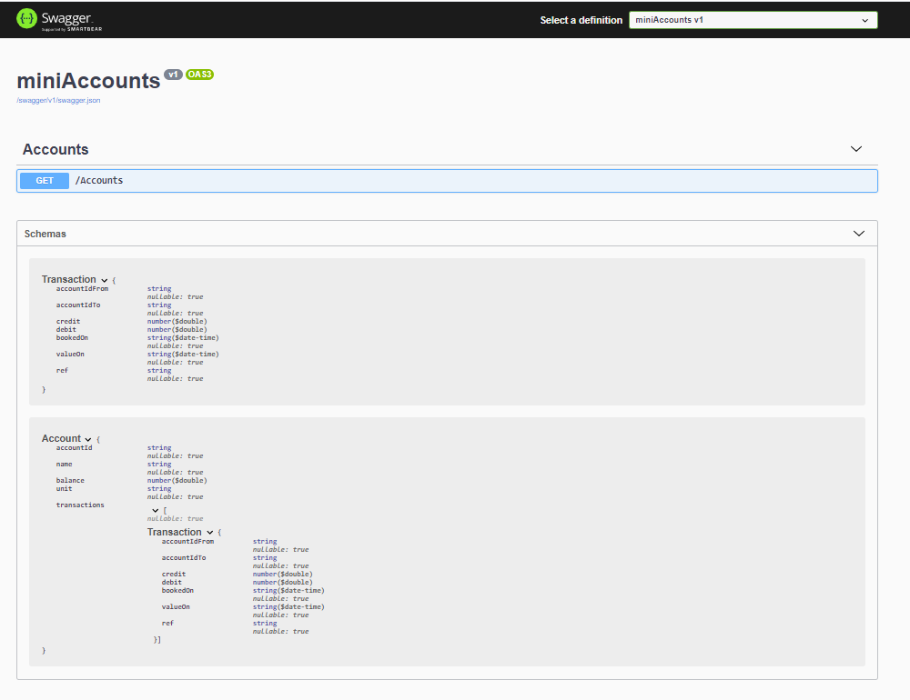

# miniAccounts
Bare Bones Ledger System

## Background
So many times a simple app requirement turns into a solution and somewhere a transactional or method to track movements & balances emerges.

Many times I've implemented systems and then had to reach for in-app methods to then somehow integrate with an external ledger - often a sales ledger.

So this is a first attempt to try to create an open libraray to encapsulate some of the basic accounting prinicipals.

## Objectives

- Provide an API First method for querying and updating accounts.
- Adhere to basic double entry bookkeeping (this will be a journey for the principal developer)
- Enable the library to be portable, i.e. not tie into specific OS features.

## Tech Stack & Features
- Starting with .Net5 C#
- Store will be in-memory but will look at data adapter.
- Design to be influenced by encyption, P2P and distributed ledger
- Reporting of course the PDF
- Export RAW WYSIWYG JSON and XBRML (very ambitious)

## Example Accounts & Ledger

| AccountId | Name          | Unit | Balance  |   |
|-----------|---------------|------|---:|---|
| 101       | Main Account  | USD  |   100|   |
| 102       | Other Account | USD  |   |   |
|           |               |      |   |   |

Account 

| Ref           | Date       | Credit | Debit | Balance |
|---------------|------------|--------:|-------:|---------:|
| Opening Bal   | 2020-11-12 | 0      |       | 0       |
| First Funding | 2020-11-12 | 100    |       | 100     |
|               |            |        |       |         |

More to follow...

## Tech Stack
Developing locally on laptop and testing our Azure APIM with hosting via Az - target is .net5 (core) which is quite new for Az hosting, not quite configured yet but should be working at some point - https://miniaccounts20201112.azurewebsites.net/swagger

